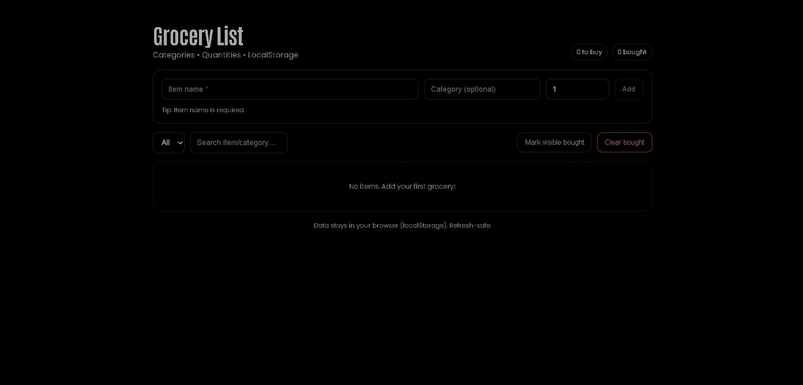

# Grocery List Manager (React + styled-components)



**Live Demo:** https://a2rp.github.io/grocery-list-manager/

A clean, frontend-only Grocery List app built with **React + styled-components**. Supports categories, quantities, check-offs, search/filter, LocalStorage, and a custom confirm modal. Transparent UI to blend with a black/dark theme.

## Features

-   Add, edit, delete items (CRUD)
-   Categories with grouping & filter
-   Quantities with quick +/− controls
-   Check off “bought” items
-   Search (item/category)
-   Bulk actions: mark visible as bought, clear bought
-   LocalStorage persistence
-   Custom confirm modal (no portals)
-   Black-theme friendly (no background overrides)

## Local Install

```bash
# 1) Clone the repo
git clone https://github.com/a2rp/grocery-list-manager.git
cd grocery-list-manager

# 2) Install dependencies
npm i

# 3) Run dev server
npm run dev
```
