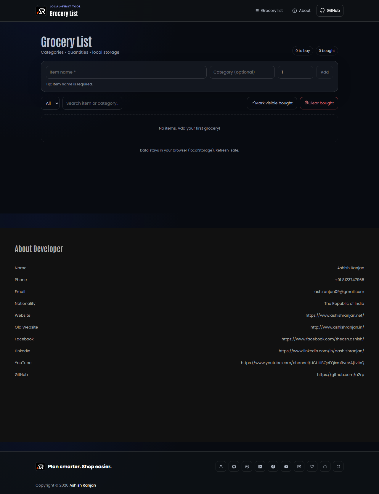

# Grocery List Manager



A responsive React grocery list manager for organizing items by category, tracking quantities, and marking items as bought. Data is stored locally in the browser, so the list remains available after a refresh.

## Features

- Add, edit, delete, and check off grocery items
- Group items by category and filter or search the list
- Adjust quantities with quick controls
- Mark visible items as bought or clear bought items in bulk
- Confirm destructive actions with an accessible modal
- Persist list data with local storage
- Responsive layout with a fixed header and floating scroll-to-top control

## Tech Stack

React, Vite, styled-components, react-icons, and browser local storage.

## Run locally

```bash
npm install
npm run dev
```

## Deployment

```bash
npm run build
npm run deploy
```

Live app: [https://a2rp.github.io/grocery-list-manager/](https://a2rp.github.io/grocery-list-manager/)

## Links

- Portfolio: [https://www.ashishranjan.net](https://www.ashishranjan.net)
- GitHub: [https://github.com/a2rp](https://github.com/a2rp)
- CodePen: [https://codepen.io/ash1198](https://codepen.io/ash1198)
- LinkedIn: [https://www.linkedin.com/in/aashishranjan](https://www.linkedin.com/in/aashishranjan)
- Facebook: [https://www.facebook.com/theash.ashish/](https://www.facebook.com/theash.ashish/)
- YouTube: [https://www.youtube.com/@ashishranjan-ashz?sub_confirmation=1](https://www.youtube.com/@ashishranjan-ashz?sub_confirmation=1)
- Email: [ash.ranjan09@gmail.com](mailto:ash.ranjan09@gmail.com)

## Support

- Support: [https://a2rp-donation-page.netlify.app/](https://a2rp-donation-page.netlify.app/)
- Buy Me A Coffee: [https://buymeacoffee.com/a2rp](https://buymeacoffee.com/a2rp)
- Patreon: [https://patreon.com/a2rp](https://patreon.com/a2rp)
